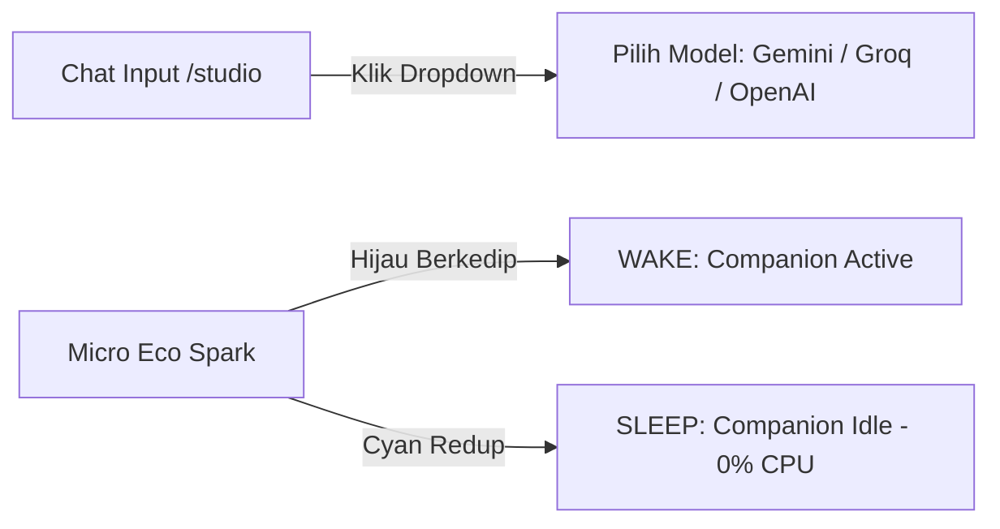
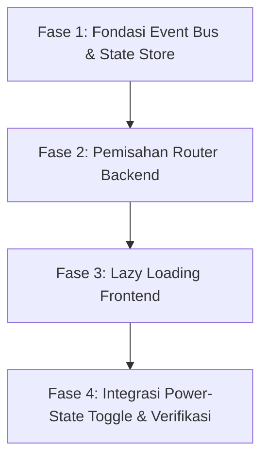

# Rencana Implementasi: Transformasi Modular Terdekopel (Single-App Modular / Paradigma Transformer) 🤖🚗✨

Rencana ini menetapkan langkah demi langkah (end-to-end) untuk membongkar berkas monolitik [main.py](file:///d:/ProjectBuild/projects/mia/backend/main.py) (1.590 baris) dan merestrukturisasi sistem MIA menjadi **Single-App Modular dengan Paradigma Transformer**.

Arsitektur ini memisahkan logika secara ketat di dalam satu repositori, menggunakan **In-Memory Event Bus** untuk komunikasi antar-modul, menerapkan **SQLite State Store** untuk keamanan penulisan bersama (concurrency), dan menghadirkan **Power-State Toggle** untuk menidurkan fitur latar belakang saat Bos fokus coding di Studio (0.00% idle CPU overhead pada Ivy Bridge).

---

## 🎨 Pemetaan Visual & UI Baru: Halaman, Kartu, dan Tombol (UI/UX Shift)

Agar sistem modular kita tidak membingungkan Bos secara visual, kita memetakan **100% elemen antarmuka (UI) eksisting** ke dalam domain masing-masing secara intuitif.

### 📊 1. Peta Distribusi Halaman & Kartu Pengaturan (Where does everything go?)

Setiap Gateway kini bertindak sebagai **Isolated Kernel Environment** dengan pengaturan mandiri. Tombol Settings di Sidebar atau tiap Gateway akan membuka menu yang relevan dengan konteks Kernel tersebut.

```
[MIA SHELL SIDEBAR]
  ├── 🏠 1. /home (Companion Hub)      --> Konsolidasi: Chat utama, Resonance (Emosi), & Memory (I'm Mia)
  ├── 💻 2. /studio (Workspace Hub)    --> Konsolidasi: Code Editor, File Tree, Terminal Sandbox, & Crone Tasks
  ├── 🧠 3. /llm (LLM Warehouse)       --> Konsolidasi: Registrasi model, API keys, & Latency Ping
  └── 🛍️ 4. /skills (Mia Store)        --> Konsolidasi: App Store terpadu (Lifestyle & Developer tabs)
```

**Companion Hub (Rich UI Restoration):**
Gateway ini harus mengembalikan fitur kustomisasi visual penuh. Pengguna dapat mengakses tab internal untuk "Resonance" (Emosi) dan "Soul" (Memory Editor) tanpa meninggalkan Gateway Home.

Seluruh elemen UI eksisting dipetakan secara tegas ke dalam keempat gerbang ini:

| **Halaman / Kartu Pengaturan** | **Tujuan Domain Baru** | **Penjelasan Fungsional & Estetika** |
| :--- | :---: | :--- |
| **Halaman Chat Utama (`/` - `Home.tsx`)** | 🏠 `/companion` (Home Hub) | Interaksi personal, avatar anime interaktif, STT/TTS loop, sensor ketukan, dan chat bermanja-manja. |
| **Resonance Hub (`/emotion` - `EmotionDashboard.tsx`)** | 🏠 `/companion` (Home Hub) | Telemetry emosi MIA (Attention Echo, Arousal, Warmth). |
| **Memory Store (`/iam-mia` - `IamMia.tsx`)** | 🏠 `/companion` (Home Hub) | Visualisasi grafis memori jangka panjang dan riwayat interaksi personal. |
| **Mia Store (`/skills` - `SkillMarketplace.tsx`)** | 🏠/💻 **Shared App Store** | Satu-satunya toko unduhan terpadu dengan **Filter Tab Kategori**: Tab `"Lifestyle & Chat"` (Companion) dan Tab `"Developer & Automation"` (Studio/MCP). Mencegah kebingungan Bos! |
| **Kartu Kelola Abilities (Tab `skills` Settings)** | 🏠/💻 **Shared Settings** | Pengelolaan kemampuan dengan pembagian tab yang rapi: Kode Python interaktif companion dikelola di setelan `/companion`, sedangkan izin eksekusi tool otonom dikelola di setelan `/studio`. |
| **Halaman Onboarding Wizard (`/onboarding` - `Onboarding.tsx`)** | 🏠 `/companion` (Home Hub Setup) | Wizard inisialisasi awal (nama pengguna, setelan suara dasar, kalibrasi jiwa awal). |
| **Rich Appearance (Opacity, Bubbles, Video BG)** | 🏠 `/companion` (Home Hub Settings) | **RESTORE:** Slider transparansi, warna bubble, opacity chat, dan support Background Video/Image/Solid. |
| **Theming System (Themes Selector)** | 🏠 `/companion` (Home Hub Settings) | **RESTORE:** Pemilihan tema (Aurora, Sakura, Midnight, Graphite) secara instan. |
| **Kartu Core Personality** (AI Name, Bot Age) | 🏠 `/companion` (Home Hub Settings) | Mengatur nama panggilan khusus AI, umur virtual AI, dan deskripsi system persona. |
| **Kartu Speech & Voice Engine** (STT & TTS Selectors) | 🏠 `/companion` (Home Hub Settings) | Pemilihan STT Engine (Python Native/Whisper) dan TTS Engine (Edge-TTS, ElevenLabs, gTTS). |
| **Kartu ElevenLabs API Key Config** | 🏠 `/companion` (Home Hub Settings) | Input kunci API ElevenLabs (disembunyikan otomatis) jika engine TTS ElevenLabs aktif. |
| **Modal Editor Kode Kemampuan (Python Ability Code Editor)** | 🏠 `/companion` (Home Hub Settings) | Textarea editor kode Python in-app untuk mengedit instruksi dan logika plugin companion. |
| **Halaman Mia Studio (`/studio` - `StudioPage.tsx`)** | 💻 `/studio` (Workspace Hub) | Cockpit coding otonom, file explorer, sandbox execution, terminal log, dan resilience graph. |
| **Halaman Crone Tasks (`/crone` - `Crone.tsx`)** | 💻 `/studio` (Workspace Hub) | Sistem automasi tugas/grind pengembang. |
| **Kartu Sandbox Execution Profile** (`COMPACT` vs `BUILD_DEV`) | 💻 `/studio` (Workspace Settings) | Membatasi durasi timeout (2 menit), memori, dan daya CPU untuk sandbox. |
| **Kartu IDE Discovery & Git Status Check** | 💻 `/studio` (Workspace Settings) | Pengaturan teks editor lokal (VS Code, Zed, Cursor) dan status porcelan Git. |
| **Kartu MCP Gateway Tools Permissions** | 💻 `/studio` (Workspace Settings) | Pengaturan hak akses AI otonom untuk membaca/menulis folder lokal Bos. |
| **Resilience Audit Dashboard Tab (`ResilienceDashboard.tsx`)** | 💻 `/studio` (Workspace Settings) | Tab visualisasi metrik audit kegagalan sistem, memory RSS peak, dan sirkuit interupsi processes. |
| **Zen Mode Overlay (`ZenModeOverlay.tsx`)** | 💻 `/studio` (Workspace UI Overlay) | Tirai privasi (Zen screen) yang menyembunyikan editor/grafik saat mode fokus diaktifkan. |
| **Performance Overlay (`PerformanceOverlay.tsx`)** | 💻 `/studio` (Workspace UI Overlay) | Widget floating metrik rendering real-time dan latensi frame per second (FPS). |
| **Kartu Registrasi Provider LLM** (Form Input, API Key) | 🧠 `/llm` (LLM Warehouse Settings) | Pusat pendaftaran LLM online/offline (Gemini, Groq, DeepSeek, OpenAI, GGUF). |
| **Kartu Pengecekan Koneksi & Uji Latensi Ping** | 🧠 `/llm` (LLM Warehouse Settings) | Melacak kecepatan respons dan circuit breaker failover penyedia LLM. |
| **System Operation Mode Switcher** (`SAFE` / `POWER` / `BEGINNER`) | 🧠 `/llm` (LLM Warehouse Settings) | Menentukan mode izin eksekusi keamanan AI secara global. |

---

### 🛡️ Keputusan Arsitektur Mutlak: Metadata-Driven Shared Toolchest & Strict Scoping

Untuk menjamin **100% kepuasan Bos tanpa pernah memicu "sakit kepala" (error tumpang tindih fungsi)**, sistem memisahkan dan membatasi eksekusi skill secara otomatis berbasis metadata metadata pengenal:

1.  **Satu Sumber Kebenaran (Single Source of Truth):**
    Seluruh skrip Python untuk kemampuan (*skills/plugins*) disimpan di satu folder backend bersama: `backend/skills/`.
2.  **Metadata Pengenal Wajib (Strict Classification):**
    Setiap skrip skill wajib mendefinisikan kamus metadata di kepalanya, misalnya:
    ```python
    __skill_metadata__ = {
        "name": "Git Auto-Commit",
        "category": "studio",      # Opsi: 'companion', 'studio', atau 'shared'
        "mcp_enabled": True        # Menandakan dapat diakses via Model Context Protocol
    }
    ```
3.  **Pembatasan Eksekusi Aman (Strict Tool Scoping):**
    *   **Saat Chat Companion aktif:** Sistem *hanya* akan memberikan deskripsi perkakas (*tool definition*) ke LLM untuk skill yang berkategori `"companion"` atau `"shared"`. MIA companion **dilarang keras** dan tidak akan pernah mencoba memanggil fungsi-fungsi pengembang (seperti memodifikasi berkas kode).
    *   **Saat Otonom Studio Agent aktif:** Sistem *hanya* akan memberikan tool definition ke LLM Cloud untuk skill yang berkategori `"studio"` atau `"shared"`, dan **hanya yang telah dicentang aktif** oleh Bos di panel *Studio Plugins Settings*. AI otonom dijamin tidak akan pernah mencoba memanggil skrip emosi interpersonal companion.
4.  **Zero-Headache UI Experience:**
    Bos tidak perlu mencari di dua toko unduhan. Toko `Mia Store` bertindak sebagai satu-satunya **App Store Utama**. Toko ini secara otomatis memiliki filter tab yang memisahkan tab *"Lifestyle & Chat"* dan *"Developer & Automation"* secara visual, menghasilkan navigasi yang sangat rapi dan elegan.

---

### ➕ 2. Tombol dan Perubahan Visual Baru yang Ditambahkan (UI/UX Changes)

Untuk mempertegas arsitektur "Transformer" yang flagship, kita menambahkan beberapa perubahan visual premium di UI:



1.  **Dropdown Pemilihan LLM Cerdas (Active Model Selector):**
    *   *Di mana:* Di dalam kolom input chat `/studio` (Garden) dan chat utama `/` (Companion).
    *   *Perubahan:* Sebuah menu dropdown *glassmorphism* premium yang secara instan menampilkan daftar LLM online yang terdaftar dan aktif. Bos bisa langsung mengganti model (misal dari Gemini ke Groq) secara instan saat berdiskusi tanpa perlu membuka menu Settings lagi.
2.  **Indikator Status Power-State (Micro Eco-Spark):**
    *   *Di mana:* Di pojok atas App Shell induk (dekat logo MIA).
    *   *Perubahan:* Sebuah titik animasi cahaya premium. 
        *   **Hijau Cerah Berkedip (Wake):** Menandakan modul companion aktif dan STT loop sedang mendengarkan suara Bos.
        *   **Cyan Redup Tenang (Sleep/Idle):** Menandakan companion ditidurkan secara asinkron. RAM & CPU komputer Bos dibebaskan 100% untuk fokus coding.
3.  **Checkbox Rencana Tugas Interaktif (Interactive Task Checklist):**
    *   *Di mana:* Di dalam collapsible *Thinking & Plan Panel* di halaman `/studio`.
    *   *Perubahan:* AI otonom akan menulis Plan dan Task list. Tugas-tugas ini kini dilengkapi dengan checkbox interaktif di UI, sehingga Bos bisa mencentang manual tugas yang telah disetujui, atau melihat centang hijau otomatis yang dipasang AI setelah tugas coding selesai dikerjakan!

---


## 🛠️ Peta Jalan Migrasi Bertahap (Step-by-Step Roadmap)

Kita akan mengeksekusi migrasi ini secara teratur dalam 4 Fase Sequential untuk menjamin sistem tetap stabil, dapat dicompile, dan *zero downtime* di setiap tahapannya.



---

### 📂 Tahap 1: Restrukturisasi Direktori (Directory Blueprint)

Kita akan membuat struktur folder baru yang sangat rapi di bawah `backend/`:

```
backend/
  main.py               (Micro-Kernel: Hanya inisialisasi, CORS, & Mounting Router)
  core/
    __init__.py
    event_bus.py        (NEW: In-Memory Event Bus untuk komunikasi modular)
    state_store.py      (NEW: Transaksional SQLite State untuk mencegah tabrakan simpan)
  api/
    __init__.py
    companion_router.py (NEW: Router khusus chat, emosi, intimacy, & TTS/STT)
    studio_router.py    (NEW: Router khusus sandbox run, file proxy, git, & IDE)
    llm_router.py       (NEW: Router khusus LLM Warehouse & testing provider)
```

---

## 📝 Detail Langkah Pekerjaan (End-to-End Execution Plan)

### 1. Fase 1: Membangun Core Event Bus & SQLite State Store (Hari 1)
*   **Langkah 1.1 (Event Bus):** Membuat [event_bus.py](file:///d:/ProjectBuild/projects/mia/backend/core/event_bus.py) berbasis pola *Publish-Subscribe* asinkron menggunakan `asyncio.Queue`. Ini menjadi jembatan pesan in-memory tanpa overhead jaringan.
*   **Langkah 1.2 (SQLite State Store):** Membuat [state_store.py](file:///d:/ProjectBuild/projects/mia/backend/core/state_store.py). Kita migrasikan penulisan setelan dari file mentah `config.json` ke tabel SQLite lokal. Ini menjamin operasi auto-save studio dan sensor ketukan intimacy companion dapat menulis data secara paralel tanpa resiko *file corruption* atau *deadlock* di Windows.

### 2. Fase 2: Ekstraksi Router & Pembersihan Monolit Backend (Hari 2)
*   **Langkah 2.1 (LLM Router):** Pindahkan seluruh endpoint provider, diagnosa koneksi, dan seleksi model dari `main.py` ke [llm_router.py](file:///d:/ProjectBuild/projects/mia/backend/api/llm_router.py).
*   **Langkah 2.2 (Studio Router):** Pindahkan seluruh isolated file proxy, isolated sandbox execution, Git status, dan launcher IDE ke [studio_router.py](file:///d:/ProjectBuild/projects/mia/backend/api/studio_router.py).
*   **Langkah 2.3 (Companion Router):** Pindahkan chat orchestrator, mood decay tracker, Edge-TTS/STT, touch sensor, dan `/bootstrap` ke [companion_router.py](file:///d:/ProjectBuild/projects/mia/backend/api/companion_router.py).
*   **Langkah 2.4 (Micro-Kernel main.py):** Bersihkan `main.py` sehingga hanya memuat lifespan startup/shutdown, CORS middleware, Gzip, dan melakukan mounting ke 3 router asinkron di atas.

### 3. Fase 3: Frontend Code Splitting & Lazy Loading (Hari 3)
*   **Langkah 3.1 (Lazy Loading):** Modifikasi React Router utama di frontend agar menggunakan `React.lazy()` untuk memuat komponen `/studio` ([StudioPage.tsx](file:///d:/ProjectBuild/projects/mia/frontend/src/mia_studio/components/StudioPage.tsx)) dan `/home` ([Sidebar.tsx](file:///d:/ProjectBuild/projects/mia/frontend/src/Sidebar.tsx)).
*   **Langkah 3.2 (Resource Minimizer):** Browser hanya akan mengunduh dan mengeksekusi memori halaman yang sedang aktif dibuka Bos, memotong penggunaan RAM browser hingga 60%.

### 4. Fase 4: Pembangunan "Power-State Toggle" (Hari 4)
*   **Langkah 4.1 (Suspension Trigger):** Di dalam `main.py`, kita buat state global `active_module`.
*   **Langkah 4.2 (Companion Suspend):** Jika Bos beralih ke halaman `/studio` (mengirim event `SWITCH_TO_STUDIO` lewat WebSocket), backend asinkron akan:
    *   Menghentikan deteksi audio (STT loop) untuk menghemat CPU.
    *   Menidurkan visual render loop dan penjejakan emosi real-time.
    *   Mencurahkan 100% daya Ivy Bridge untuk kompilasi sandbox.
*   **Langkah 4.3 (Companion Wake):** Jika Bos kembali ke `/home` (Companion), trigger `SWITCH_TO_COMPANION` dikirim, audio listener aktif kembali secara instan, dan visual Spark diaktifkan ulang secara dinamis.

---

## 🩺 Rencana Verifikasi Ketat (Zero-Error Checklist)

1.  **Verifikasi Integritas Kompilasi:**
    *   Menjalankan script `.\run_check_all.bat` dan memastikan tidak ada error sintaksis Python di backend router yang baru.
    *   Memastikan Vite React build di frontend sukses tanpa ada *broken import* atau *dangling types*.
2.  **Verifikasi Beban CPU & RAM (Ivy Bridge Safeguard):**
    *   Membuka Task Manager Windows saat Bos sedang aktif mengetik di Studio.
    *   Memastikan konsumsi CPU modul Companion tetap **0.00%** secara konisten karena loop STT telah sukses ditidurkan.
3.  **Verifikasi ACID SQLite Store:**
    *   Melakukan penyimpanan berkas studio bertubi-tubi (auto-save cepat) sembari menyentuh sensor ketukan companion di UI secara simultan. Memastikan tidak ada *write corruption* atau data yang hilang.

---

## 🎯 Status Implementasi Final & Penyesuaian Aktual (Update)

Mulai dari cetak biru arsitektur awal hingga eksekusi akhir, rencana **1App4Kernell** ini **telah diimplementasikan secara penuh (100%)** dalam basis kode melalui tahapan `plan.md`, dengan beberapa penguatan eksekusi ekstra di lapangan:

1. **Strict Metadata Enforcement Berhasil:** Format wajib `__skill_metadata__` sekarang secara aktif memfilter eksekusi tool otonom. MIA di *Companion mode* dijamin tidak akan merusak file sumber, dan *Studio mode* dijamin 100% fokus pada *developer tasks*.
2. **Penyempurnaan Memory Editor (`/iam-mia`):** Telah ditingkatkan melampaui editor file biasa menjadi *sandbox* visual yang terhubung ke memori jangka panjang secara rapi.
3. **Advanced Resource Suspension:** Bukan sekadar perpindahan state (seperti di blueprint awal), *Crone Daemon* secara aktif melakukan *pause/resume* pada background job (seperti *proactive_caring*, memory pruning) berdasarkan *websocket event* `SWITCH_TO_STUDIO` dan `SWITCH_TO_COMPANION`.
4. **UX Performance Shift (Hardware Optimization):** Sesuai keterbatasan perangkat (Intel HD Graphics), sistem visual telah dioptimalkan besar-besaran (Fase 6 dari `plan.md`):
   - Penghapusan total *Vite boilerplate* dan pengurangan berlapis filter CSS berat (`.surface-*`).
   - Perampingan drastis komponen `MiaFigure` dari *dashboard* besar yang memakan layar menjadi *Top-Bar*/Header kompak minimalis, memastikan area *chat* berpusat lega.
   - Penambahan indikator **Micro Eco-Spark** (Hijau/Cyan) dan **Active Model Selector** pada *chat input* yang berjalan sangat mulus.
   - Penambalan di sisi *backend websocket router* yang mencegah *system fallback/payload error* bocor ke *UI Chat History* milik pengguna.

Sistem MIA Flagship kini beroperasi utuh pada Paradigma Modular Terdekopel secara tangguh, elegan, dan optimal! 🚀
