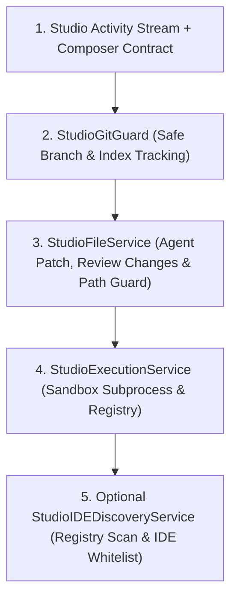

# MIA STUDIO EXECUTION CONTRACT (V1.3)
TYPE: ARCHITECTURAL LAW (NON-NEGOTIABLE)
STATUS: MODULE CONTRACT — ALIGNED UNDER `docs/1App5Kernell.md`
SCOPE: StudioExecutionService, StudioFileService, StudioIDEDiscoveryService, StudioGitGuard

> **Alignment Note (2026-05-23):** Kontrak ini tetap berlaku untuk keamanan backend Studio. Namun "Local IDE" adalah integrasi opsional. Alur utama Studio terbaru adalah agent cockpit: prompt -> plan -> approval -> tool execution -> activity stream -> Review Changes.

---

## 1. OPTIONAL LOCAL IDE DISCOVERY & LAUNCHER SAFETY (THE "BRIDGE" RULE)

### 1.1 Discovery Scanner Sanitization
- **Windows Registry Guard:** Layanan `StudioIDEDiscoveryService` diperbolehkan memindai registry Windows (`HKCU\Software\Microsoft\Windows\CurrentVersion\Uninstall` atau `HKLM`) untuk mencari direktori instalasi IDE (VS Code, Cursor, Trae, Qoder, Codex, IntelliJ).
- **Explicit Executable Whitelisting:** Hanya eksekutor IDE resmi yang didaftarkan pada whitelist yang boleh diluncurkan. Dilarang memproses argumen eksternal yang tidak dikenal untuk menangkal eksekusi kode berbahaya (*command injection*).
- **Isolated Launching:** Pemanggilan perintah OS untuk membuka IDE wajib menggunakan `subprocess.Popen` tanpa argumen shell tambahan (`shell=False`) dan diarahkan secara mutlak ke folder root proyek menggunakan `StudioFileService._get_project_root()`.

---

## 2. SANDBOX ISOLATION & RUNTIME LIMITS (THE "NO ESCAPE" RULE)

### 2.1 Execution Registry & UUID
- **Execution ID:** Setiap tugas latar belakang atau perintah `RUN` wajib dialokasikan `execution_id` (UUID) yang mengikat log, visualisasi graph, dan metadata subproses.
- **ProcessRegistry:** Semua PID aktif wajib terdaftar secara transparan dalam registry asinkron dengan pembersihan otomatis (*orphan process cleaner*) secara berkala.

### 2.2 Strict Limits & Timeout
- **Hard Timeout:** Batas maksimal eksekusi adalah 25 detik. Jika terlampaui, lakukan terminasi bertahap (1 detik) kemudian eksekusi paksa menggunakan **HARD KILL (SIGKILL / TaskKill)**.
- **Memory Watchdog:** Limitasi penggunaan RAM adalah 256MB per proses. Watchdog thread wajib memeriksa konsumsi memori setiap 200ms. Jika terlampaui, bunuh proses seketika.

---

## 3. FILE ACCESS GUARD & AUTO-SAVE INTEGRITY (THE "PROXY" RULE)

### 3.1 Proxy-Only Workspace Modification
- **No Direct Mutation:** Dilarang menggunakan panggilan sistem langsung dari sandbox untuk mengubah file di luar direktori proyek. Semua operasi tulis dan baca wajib melewati `StudioFileService`.
- **Path Normalization:** Validasi jalur absolut (`os.path.abspath()`) dan perbandingan awalan folder (`real_path.startswith(ALLOWED_ROOT)`) wajib ditegakkan untuk memblokir traversal `../` atau symbolic link escape.

### 3.2 Agent Patch / Auto-Save Execution Law
- **Atomic Writing:** Setiap penulisan kode asinkron oleh MIA wajib menggunakan taktik: `Write to Temp` -> `Validate Syntax` -> `Atomic Rename`. Hal ini untuk menjamin berkas proyek tidak korup di Windows jika proses terputus.
- **Review Changes First:** Perubahan yang dibuat agent wajib menghasilkan changed-files summary dan diff read-only. Auto-save boleh tetap aktif untuk penyimpanan teknis, tetapi UI harus tetap memperlihatkan perubahan sebagai Review Changes.
- **Auto-Save Status Sync:** Ketika file berubah, backend harus mengirimkan sinyal `"project_updated"` atau event activity yang setara melalui WebSocket agar status repositori disinkronkan.

---

## 4. GIT GUARD & VERSION SAFETY (THE "SAFE HARBOR" RULE)

### 4.1 Git Branch & Status Tracking
- **Command Sanitization:** Akses ke Git lokal wajib menggunakan pembungkus CLI aman (seperti pustaka `GitPython` atau `subprocess` terisolasi tanpa `shell=True`). Dilarang keras meneruskan string mentah dari input pengguna ke dalam shell Git.
- **Active Branch & Index Monitoring:** Sistem wajib mendeteksi status repositori secara pasif (tidak merusak isi berkas) untuk mengekstrak nama branch aktif dan jumlah berkas yang dimodifikasi.

### 4.2 Snapshot & Safe Deploy Commit
- **Auto-Commit Staging:** Sebelum MIA melakukan pembaruan kode besar (*deploying changes*), sistem wajib menyarankan pembuatan Git Commit sementara atau mencatat riwayat perubahan agar Bos dapat dengan mudah melakukan `git checkout` atau memeriksa perbandingan versi (*diff*) di IDE lokal.

---

## 5. REVISED START BUILD ORDER (PHASED EXECUTION)

Untuk menjamin kedisiplinan pembangunan, urutan pembuatan modul wajib mengikuti bagan berikut:

---

## 6. ERROR STANDARDS & NORMALIZATION
Semua galat (error) di dalam sistem Studio wajib dinormalisasi secara baku mengikuti pola:
`STUDIO_ERROR::<TYPE>::<MESSAGE>`

Contoh normalisasi error:
- `STUDIO_ERROR::IDE_NOT_FOUND::Selected local IDE is not installed`
- `STUDIO_ERROR::GIT_FAIL::Failed to parse active git branch`
- `STUDIO_ERROR::TIMEOUT::Sandbox execution exceeded 25s limit`

---

### FINAL APPROVAL UNTUK HAL DI ATAS — MIA STUDIO EXECUTION CONTRACT v1.3
**STATUS:** MODULE CONTRACT — PROCEED UNDER `docs/1App5Kernell.md`

Hukum arsitektur ini mengunci keamanan backend Studio. Jangan membangun browser IDE. Fokus pada agent cockpit, activity stream, Review Changes, tool execution, dan integrasi lokal yang aman bila dibutuhkan.
