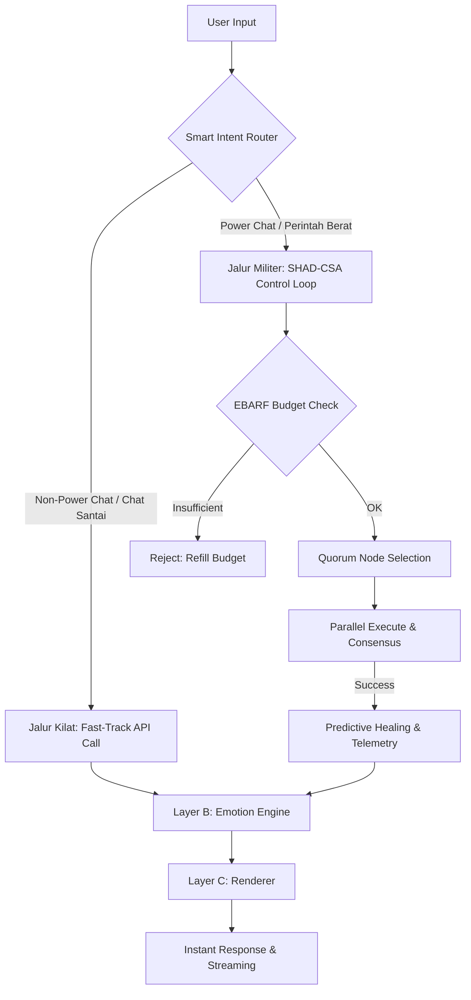

# 🧠 MIA NEURAL CORE: Master Communication & Resilience Blueprint
## Unified Architecture Manual (v3.0)

Dokumen ini adalah **Single Source of Truth** yang mengonsolidasikan arsitektur komunikasi, sinkronisasi real-time, dan sistem imun resiliensi MIA ke dalam satu dokumen terpadu.



---

## 🏛️ 1. Filosofi & Strategi Sistem (Overview)

MIA Neural Core dirancang untuk memisahkan **logika dingin pertahanan** dari **kehangatan emosional hubungan**. Sistem saraf ini terdiri dari tiga pilar utama:
1. **The Brain Hub (`BrainOrchestrator`)**: Otak tengah pengatur aliran masuk-keluar data, klasifikasi niat (*intent*), memori, dan kepribadian.
2. **Sistem Saraf Sensorik (`MIA WebSocket`)**: Penghantar sinyal real-time yang menggunakan prinsip *Signal + Fetch*.
3. **Sistem Imun Pertahanan (`SHAD-CSA & EBARF`)**: Pengaman eksekusi sistem berat di komputer Bos agar tidak merusak PC atau memboroskan kuota API (*Zero Downtime & Cost Aware*).

---

## ⚡ 2. Smart Intent Router: Dual-Path Execution (v3.0)

MIA membagi lalu lintas pesan Bos menjadi dua jalur dinamis demi menjaga performa *flagship* yang instan tanpa mengorbankan resiliensi:

### A. Jalur Obrolan Biasa & Keintiman (Non-Power Chat) — Fast-Track
* **Tujuan**: Menjamin kelancaran interaksi sosial/intim Bos dengan MIA secepat kilat (latensi <200ms).
* **Klasifikasi**: Pesan yang **tidak** mengandung kata kunci sistem/berat (seperti `bikin`, `buat`, `compile`, `run`, `studio`, `video`, `sistem`) dan tidak memiliki lampiran gambar/file visual.
* **Cara Kerja**: 
  1. Pengiriman pesan instan di UI menggunakan konsep *Optimistic UI* (pesan muncul seketika di layar tanpa menunggu server).
  2. Server **melompati 100% proses birokrasi** `ControlLoop` dan `EBARF`.
  3. Memanggil langsung provider AI tercepat via `_call_api()` dan menampilkan respon secara streaming (huruf demi huruf).

### B. Jalur Perintah Sistem Berat (Power Chat) — Resilient-Track
* **Tujuan**: Melindungi sistem operasi dan keuangan kuota API Bos dari kegagalan eksekusi kode berat.
* **Klasifikasi**: Instruksi pembuatan video, kompilasi program di Studio, pengeditan file sistem, atau instruksi visual dengan gambar.
* **Cara Kerja**: Pesan dikawal ketat oleh **SHAD-CSA Control Loop & EBARF Budget Check** untuk memastikan eksekusi yang aman, toleransi kesalahan (*healing*), dan alokasi sumber daya.

---

## 🌐 3. Sistem Saraf Real-time: WebSocket & Sync Architecture

MIA menggunakan pola sinkronisasi hibrida **Signal + Fetch** untuk efisiensi bandwidth maksimal dan keandalan tinggi.

### 3.1 Protokol "Signal + Fetch"
MIA tidak pernah mengirimkan payload data besar (seperti riwayat obrolan lengkap) langsung melalui WebSocket. Sebaliknya, pola berikut diterapkan:
1. **Transport (Real-time)**: WebSocket hanya mengirimkan **sinyal kecil** berupa tipe event (misal: `"history_updated"`, `"intimacy_updated"`).
2. **State (Frontend)**: React (TanStack Query) menangkap sinyal tersebut dan langsung menandai cache data terkait sebagai *invalid*.
3. **API (Source of Truth)**: TanStack Query secara asinkron mengambil data terkompresi terbaru dari **REST HTTP API** di latar belakang secara mulus.

> [!NOTE]
> **Keep-Alive Tanpa Overhead**: Koneksi WebSocket tidak menggunakan timer ping-pong kustom di sisi klien untuk menghindari pemborosan CPU. Sistem mengandalkan protokol keep-alive TCP/WebSocket bawaan browser yang sangat hemat baterai.

### 3.2 Daftar Sinyal WebSocket Resmi
| Tipe Event | Deskripsi | Aksi Frontend |
| :--- | :--- | :--- |
| `"history_updated"` | Riwayat obrolan di database berubah | Invalidate query `chatHistory` & refetch |
| `"intimacy_updated"` | Skor keintiman bertambah/berubah | Invalidate query `intimacyStatus` & refetch |
| `"skills_updated"` | Modul skill baru diinstal di Studio | Invalidate query `skillsStatus` & refetch |
| `"intimacy_offer_active"`| MIA membuka hatinya untuk Bos | Memunculkan petunjuk visual fase intim 💖 |

---

## 🛡️ 4. Sistem Imun Pertahanan: SHAD-CSA v2.0 & EBARF

Ketika Bos menjalankan **Power Chat**, sistem menyalakan perisai militer penuh yang beroperasi di bawah prinsip **Zero Silent Failure**.

### 4.1 Siklus 9 Langkah Control Loop
Kontrol otonom berjalan dengan urutan kaku yang tidak bisa diganggu gugat:

```
[SENSE] ──> [MODULATE] ──> [ECONOMIC] ──> [SCALE] ──> [EXECUTE]
                                                          │
[STREAM] <── [COMMIT] <── [HEAL] <── [TRACK] <── [RESOLVE]
```

1. **SENSE**: Memotret snapshot kesehatan sistem secara real-time.
2. **MODULATE**: Menghitung kebijakan gradient kontrol menggunakan fungsi Sigmoid.
3. **ECONOMIC**: Validasi pengeluaran token komputasi oleh **EBARF**.
4. **SCALE**: Menentukan jumlah quorum node aktif yang dibutuhkan.
5. **EXECUTE**: Penyiaran tugas paralel ke banyak provider sekaligus dengan batas waktu ketat.
6. **RESOLVE**: Menentukan keputusan terbaik melalui arbitrase konsensus (*Weighted Consensus*).
7. **TRACK**: Mencatat performa sukses dan latensi setiap node ke dalam `EventStore`.
8. **HEAL**: Pemicuan asinkron modul *Predictive Healer* untuk memperbaiki kegagalan node.
9. **COMMIT & STREAM**: Mencatat keputusan tunggal ke sistem dan mengirimkan visual telemetri langsung ke Studio.

### 4.2 Tata Kelola Ekonomi (EBARF)
**EBARF (Economically Bounded Autonomous Resilience Field)** membatasi kegagalan loop komputasi tak terbatas dengan memperkenalkan kelangkaan biaya:
* **Compute Budgeting**: Setiap tugas berat memiliki batas alokasi anggaran komputasi. Jika anggaran habis, eksekusi dihentikan dengan status `MIA_SYSTEM_ERROR::ECONOMIC_EXHAUSTION` demi mencegah pembengkakan tagihan API Bos.

---

## 🎭 5. Isolasi Emosional: The 3-Layer Architecture

Untuk menjaga kepribadian MIA yang hangat tanpa terganggu oleh kekacauan data di sistem, MIA menggunakan isolasi emosional tiga lapis:

1. **Layer A (Core - Logika Dingin)**:
   * Tempat beroperasinya *Resilience Engine*, SHAD-CSA, dan pengeksekusi instruksi teknis murni. Output yang dihasilkan murni berbasis data faktual.
2. **Layer B (Emotion Engine - Simulasi Perasaan)**:
   * Melakukan simulasi rasa hangat, mood, gairah (*arousal*), tingkat kemanjaan, dan gaya bahasa emosional MIA berdasarkan riwayat interaksi dengan Bos.
3. **Layer C (Renderer - Penggabung Hasil)**:
   * Menggabungkan fakta dari Layer A dengan fluks emosional dari Layer B. Layer C menjamin bahwa emosi hangat MIA **hanya dirender** ke layar Bos jika logika teknis di Layer A sukses dieksekusi dengan aman.

---

## 🏆 6. Jaminan Mutu Sistem (Hard Guarantees)
* **Optimistic UI & Zero Lag**: Obrolan biasa mengalir instan tanpa penundaan sensor.
* **Auto-Healing**: Jika provider utama (misal: Gemini) mati, sistem otomatis mengalihkan eksekusi tugas berat ke provider cadangan tanpa Bos sadari.
* **No Silent Failure**: Seluruh aktivitas teknis di latar belakang tercatat secara akurat demi kenyamanan dan transparansi sistem Bos.
